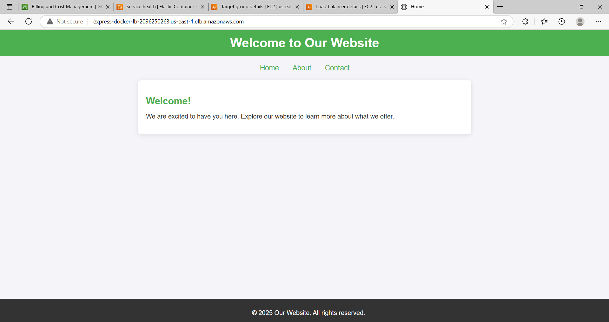
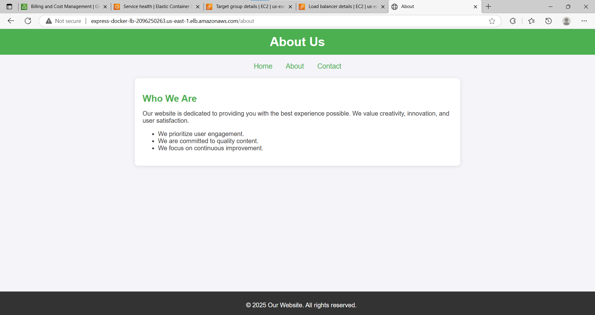
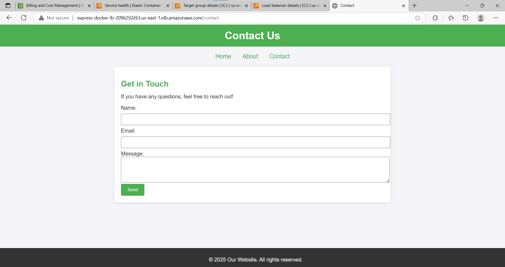

# DevOps Project: Automating Deployment of an Express Application with Docker, AWS, Ansible and GitHub Actions

## Overview

This project demonstrates the end-to-end workflow of deploying a Node.js Express application using Docker, AWS (ECR, ECS, VPC, Load Balancer), Ansible and GitHub Actions for automation. Below is a step-by-step breakdown of how the project was created, from scratch to completion.

---

# Project Outputs

Below are the outputs from the project showcasing the final deployment and workflow results:

**Application Running in Browser**:  
The deployed application accessible through the Load Balancer's DNS URL. It shows the `home`, `about`, and `contact` pages served correctly.

### Access the Deployed Application

You can access the deployed application using the following link:  
[http://express-docker-lb-2096250263.us-east-1.elb.amazonaws.com/](http://express-docker-lb-2096250263.us-east-1.elb.amazonaws.com/)

**Project Status - Note**: The project was deployed using AWS Fargate, which incurs ongoing charges for running services. To avoid unnecessary costs, the application has been taken down from AWS. The steps and workflow described in this guide remain valid for redeployment if needed.  

---

## 1. Creating the Express Application

I started by creating a simple Express application to serve as the foundation of the project. Here's how it was done:

- **Initialized a Node.js Project**: I ran `npm init` to set up a basic Node.js project structure.
- **Installed Dependencies**: Added `express` as a dependency using `npm install express`.
- **Set Up the Server**: Created a `server.js` file that:
  - Defined three endpoints (`/`, `/about`, `/contact`).
  - Served corresponding HTML files from a `public` folder.
- **Ran the Server**: Configured it to listen on port `3000` to ensure it worked correctly.

---

## 2. Dockerizing the Application

After verifying the application, I containerized it using Docker:

- **Created a `Dockerfile`**:
  - Used a Node.js base image to fetch the runtime environment.
  - Defined the working directory, copied project files, and installed dependencies.
  - Exposed port `3000` and defined the command to run the server inside the container.
  
- **Built and Tested the Docker Image**:
  - Built the image using `docker build` and tagged it.
  - Ran the container to confirm the application functioned as expected.

---

## 3. Configuring AWS Infrastructure

To deploy the application, I set up AWS infrastructure step by step:

### 3.1 Virtual Private Cloud (VPC)
- **Created a VPC**: This served as the isolated network for deploying the application and its services.

### 3.2 Subnets
- **Defined Subnets**: Associated them with the VPC in desired availability zones.

### 3.3 Security Groups
- **Created a Security Group**:
  - Configured rules to allow HTTP traffic on port `80` and the container's exposed port `3000`.
  - Used this security group for the ECS service and load balancer.

### 3.4 Amazon ECR
- **Set Up a Repository**:
  - Created a repository on AWS Elastic Container Registry (ECR) to host the Docker image of the application.

### 3.5 Amazon ECS
- **Created a Cluster**: Using AWS ECS, set up a cluster to host the application containers.
- **Defined a Task Definition**:
  - Used Fargate as the launch type.
  - Specified the container name, image URI, and exposed port `3000`.
- **Created a Service**:
  - Configured it to use the task definition.
  - Associated the service with the VPC, subnets, and security group.
  
### 3.6 Application Load Balancer (ALB)
- **Set Up a Load Balancer**:
  - Configured an Application Load Balancer to route traffic to the service.
  - Created a target group and configured it to listen on port `80`.
  - The ALB provided a static DNS name to access the application.

---

## 4. Automating Deployment with Ansible and GitHub Actions

### 4.1 Creating an Ansible Playbook
To automate task definition updates and service restarts on ECS, I wrote an Ansible playbook:

- **Tasks in the Playbook**:
  1. **Update the Task Definition**:
     - Used `community.aws.ecs_taskdefinition` to define parameters like task family name, container name, image URI, and region.
  2. **Update the Service**:
     - Used `community.aws.ecs_service` to restart the service with the new task definition.

---

### 4.2 Setting Up GitHub Actions Workflow
To automate the build, push, and deploy process, I created a GitHub Actions workflow:

- **Added Secrets**: Stored AWS credentials, ECR repository, and ECS details in the GitHub Actions secret vault:
  - `AWS_ACCESS_KEY_ID`
  - `AWS_SECRET_ACCESS_KEY`
  - `AWS_REGION`
  - `ECR_REPOSITORY`
  - `ECS_CLUSTER`
  - `ECS_SERVICE`
  - `ECS_TASK_DEFINITION_FAMILY`
  - `ECS_CONTAINER_NAME`
  
- **Created a Workflow YAML File**:
  - Triggered the workflow on every commit to the `main` branch.
  - Defined a job to run on Ubuntu with the following steps:
    1. **Check Out Code**:
       - Used `actions/checkout@v3` to get the repository code.
    2. **Configure AWS Credentials**:
       - Used `aws-actions/configure-aws-credentials@v2` to set up AWS client credentials.
    3. **Log In to ECR**:
       - Used `aws-actions/amazon-ecr-login@v1` for authentication with ECR.
    4. **Build and Push Docker Image**:
       - Built the Docker image and tagged it.
       - Pushed the image to the AWS ECR repository.
    5. **Run Ansible Playbook**:
       - Installed Ansible.
       - Ran the playbook to update the ECS task definition and restart the service.

---

## 5. Final Deployment and Testing

Once the workflow was complete:
- The Docker image was built and pushed to ECR.
- The ECS task definition and service were updated via the Ansible playbook.
- The updated service was accessible through the load balancer’s DNS name.

---

## Conclusion

This project demonstrates how to deploy a simple Node.js application in a fully automated pipeline using Docker, AWS, and GitHub Actions. By leveraging these tools, we can ensure scalability, maintainability, and ease of deployment for modern applications.